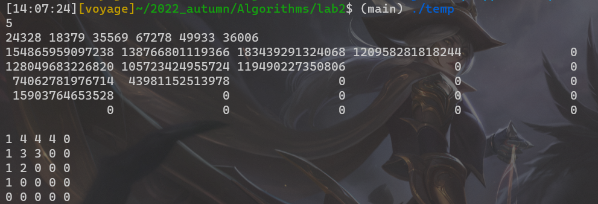
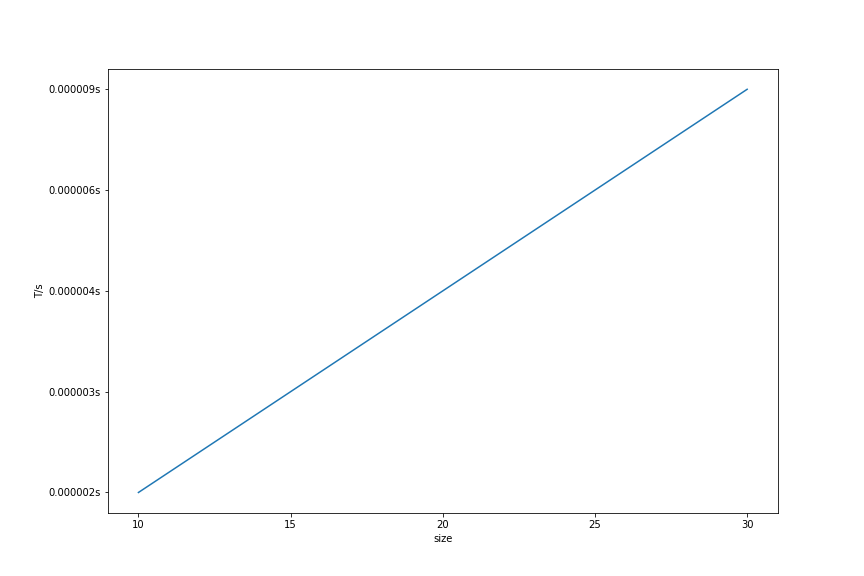

## 实验二 动态规划

PB20000137 李远航

##### 一、实验内容及要求

1. 求矩阵链乘最优方案
    - n个矩阵链乘，求最优链乘方案，使链乘过程中乘法运算次数最少
    - n的取值5, 10, 15, 20, 25，矩阵大小见2_1_input.txt
    - 求最优链乘方案及最少乘法运算次数，记录运行时间，画出曲线分析
    - 仿照P214 图15-5，打印n=5时的结果并截图
2. 求最长公共子序列
    - 给定两个序列X、Y，求出这两个序列的最长公共子序列（某一个即可）
    - X, Y序列由A、B、C、D四种字符构成,序列长度分别取10、15、20、25、30，见2_2_input.txt
    - 打印最长公共子序列，记录运行时间，画出曲线分析

##### 二、实验设备及环境

```bash
OS: Ubuntu 20.04 focal(on the Windows Subsystem for Linux)
Kernel: x86_64 Linux 5.10.102.1-microsoft-standard-WSL2
CPU: Intel Core i5-10200H @ 8x 2.4GHz
GPU: NVIDIA GeForce GTX 1650 Ti
g++ (Ubuntu 9.4.0-1ubuntu1~20.04.1) 9.4.0
```

##### 三、实验方法和步骤

1. 求矩阵链乘最优方案

    - 递归求解公式
        $$
        m[i,j]=\left\{
        \begin{aligned}
        &0 &&\text{if}\ \ i=j\\
        &\min_{i\leq k < j}m[i,k]+m[k+1,j]+p_{i-1}p_kp_j &&\text{if}\ \ i<j
        \end{aligned}
        \right.
        $$

    - 核心代码

        ```c++
        for (int l = 2; l <= n; l++)
        {
            for (int i = 1; i <= n - l + 1; i++)
            {
                int j = i + l - 1;
                m[i][j] = INT64_MAX;
                for (int k = i; k <= j - 1; k++)
                {
                    temp = m[i][k] + m[k + 1][j] + data[i - 1] * data[k] * data[j];
                    if (temp < m[i][j])
                    {
                        m[i][j] = temp;
                        s[i][j] = k;
                    }
                }
            }
        }
        ```
	    
	- 复杂度分析
	
	    三重循环：$\Omega(n^3)$
	
2. 求最长公共子序列

    - 递归求解公式
        $$
        c[i,j]=\left\{
        \begin{aligned}
        &0 && i=0\ ||\ j=0 \\
        &c[i-1,j-1]+1 && i,j>0\ \ \text{\&\&}\ x_i=y_i\\
        &max(c[i,j-1],c[i-1,j])&&i,j>0\ \ \text{\&\&}\  x_i \neq y_i\\
        \end{aligned}
        \right.
        $$

    - 核心代码

        ```c++
        for (int i = 1; i <= n; i++)
        {
            for (int j = 1; j <= n; j++)
            {
                if (p[i] == q[j])
                {
                    c[i][j] = c[i - 1][j - 1] + 1;
                    b[i][j] = '\\';
                }
                else if (c[i - 1][j] >= c[i][j - 1])
                {
                    c[i][j] = c[i - 1][j];
                    b[i][j] = '|';
                }
                else
                {
                    c[i][j] = c[i][j - 1];
                    b[i][j] = '-';
                }
            }
        }
        ```
        
    - 复杂度分析
    
        两重循环：$O(n^2)$

##### 四、实验结果和分析

1. 求矩阵链乘最优方案

    - 实验运行结果见`output.txt`文件

    - $n=5$时的运行结果

        

    - 运行时间曲线

        

        观察发现，运行时间基本随着数据规模的增大线性增长，与理论分析复杂度不同的原因是数据规模过小

2. 求最长公共子序列

    - 实验运行结果见`output.txt`文件

    - 运行时间曲线

        

        观察发现，运行时间基本随着数据规模的增大线性增长，与理论分析复杂度不同的原因是数据规模过小

##### 五、实验思考与反思

- 学习了动态规划的思想以及求解动态规划问题的策略
- 增强了代码能力
- 增强了分析和复现算法的能力
