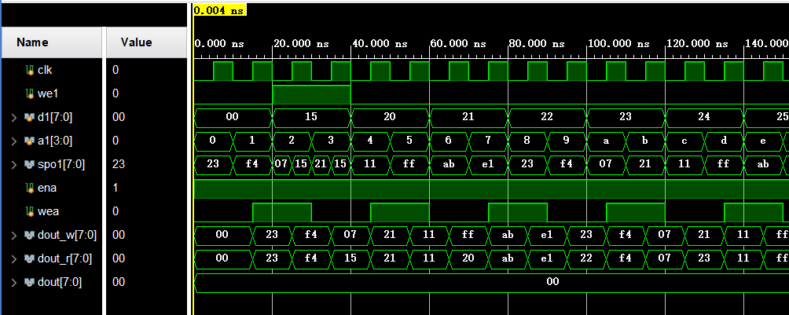
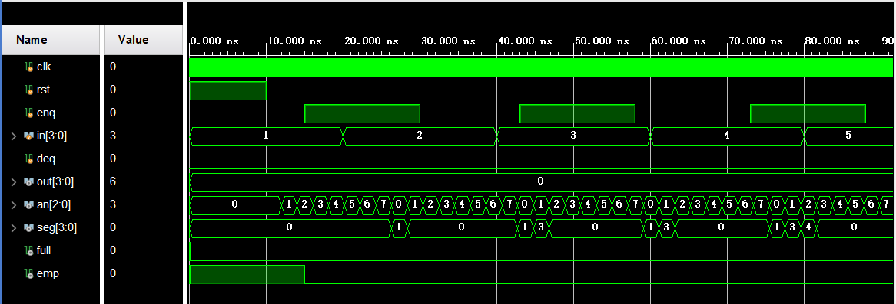

## Lab1 寄存器堆与存储器及其应用

<p style="text-align:right"> 李远航</p>
<p style="text-align:right"> PB20000137</p>

#### 1. 实验内容

- 行为方式参数化描述寄存器堆，功能仿真
- IP 例化分布式和块式 16 x 8 位单端口 RAM，功能仿真和对比
- 设计 FIFO 队列电路的数据通路和控制器，结构化方式描述数据通路，Moore 型 FSM 描述控制器，功能仿真
- FIFO 队列电路下载至 FPGA 中测试

#### 2. 实验过程

##### (1)行为方式参数化描述 32×WIDTH 寄存器堆

- `verilog`代码

  ```verilog
  module register_file #(parameter WIDTH = 32)(
      input clk,
      input [4:0] ra0,
      output [WIDTH-1:0] rd0,
      input [4:0] ra1,
      output [WIDTH-1:0] rd1,
      input [4:0] wa,
      input we,
      input [WIDTH-1:0] wd
  );
      reg [WIDTH-1:0] regfile[0:31];

      assign rd0 = regfile[ra0];
      assign rd1 = regfile[ra1];

      always @(posedge clk) begin
          if (we == 1)
              regfile[wa] <= wd;
      end
  endmodule
  ```

- 功能仿真

  

##### (2)IP 例化分布式和块式 16 x 8 位单端口 RAM

- 功能仿真
  spo1 端口为分布式 RAM 输出，douta 为块式 RAM 输出，两种 ip 核共用 a1 地址端口和 d1 数据端口
  

##### (3)用三端口 8×4 寄存器堆实现最大长度为 8 的 FIFO 队列

- 逻辑结构

  

<style>
  img.big{
    padding: 0px 0px 120px 0px ;
  }
</style>

- 状态机设计：

  ```mermaid
  graph LR
        IDLE((IDLE))--enq and !full-->ENQE((ENQE))
        IDLE((IDLE))--deq and !emp-->DEQE((DEQE))
        ENQE((ENQE))-->IDLE((IDLE))
        DEQE((DEQE))-->IDLE((IDLE))
  ```

- `verilog`代码

  异步信号取边沿(SEDG)

  ```verilog
  module SEDG(
          input a,
          input clk,
          output p    //
      );
      reg st, pt, s;
      always@(posedge clk)
          st <= a;
      always@(posedge clk)
          s <= st;
      always@(posedge clk)
          pt <= s;
      assign p = (~pt) & s;
  endmodule
  ```

  寄存器文件(RF)

  ```verilog
  module register_file(
      input clk,
      input [2:0] ra0,
      output [3:0] rd0,
      input [2:0] ra1,
      output [3:0] rd1,
      input [2:0] wa,
      input we,
      input [3:0] wd
  );
      reg [3:0] regfile[0:7];
      assign rd0 = regfile[ra0];
      assign rd1 = regfile[ra1];
      always@(posedge clk) begin
          if (we == 1)
              regfile[wa]  <=  wd;
      end
  endmodule
  ```

  数码管显示单元(SDU)

  ```verilog
  module SDU(
          input rst, clk,
          input [3:0] rd,
          input [7:0] valid,
          output [2:0] ra,
          output [2:0] an,
          output [3:0] seg
      );
      reg [23:0] count;
      assign an = ra;
      assign ra = count[12:10];
      always@(posedge clk)
      begin
          if (rst) begin
              count <= 24'd0;
          end else begin
              count <= count + 1;
          end
      end
      assign seg = valid[ra] ? rd : 0;
  endmodule
  ```

  队列控制单元(LCU)

  ```verilog
  module LCU(
      input clk, rst,
      input [3:0] in, rd0,
      input enq, deq,
      output reg [3:0] out,
      output full, emp, we,
      output [2:0] ra0, wa,
      output [3:0] wd,
      output reg [7:0] valid
  );
      assign wa = tail;
      assign wd = in;
      assign we = enq;
      assign ra0 = head;
      parameter IDLE = 2'b00;
      parameter ENQU = 2'b01;
      parameter DEQU = 2'b10;
      reg [1:0] cs, ns;
      reg [2:0] head, tail;
      reg [3:0] count;
      always@(posedge clk) begin
          if (rst == 1)
              cs <= IDLE;
          else
              cs <= ns;
      end
      always @(*) begin
          case (cs)
              IDLE: begin
                  if (enq & !full)
                      ns <= ENQU;
                  else if (deq & !emp)
                      ns <= DEQU;
                  else
                      ns <= IDLE;
              end
              ENQU: ns <= IDLE;
              DEQU: ns <= IDLE;
          endcase
      end
      always@(posedge clk)begin
          if (rst == 1) begin
              tail <= 0;
              head <= 0;
              valid <= 0;
              count <= 0;
              out <= 0;
          end
          else if (cs == ENQU) begin
              valid[tail] <= 1;
              tail <= tail + 1;
              count <= count + 1;
          end
          else if (cs == DEQU) begin
              valid[head] <= 0;
              head <= head + 1;
              count <= count - 1;
              out <= rd0;
          end
      end
      assign full = (count == 4'd8) ? 1 : 0;
      assign emp = (count == 4'd0) ? 1 : 0;
  endmodule
  ```

  顶层模块

  ```verilog
  module fifo(
      input clk, rst,     //时钟（上升沿有效）、同步复位（高电平有效）
      input enq, 		    //入队列使能，高电平有效
      input [3:0] in,	    //入队列数据
      input deq,		    //出队列使能，高电平有效
      output [3:0] out, 	//出队列数据
      output [2:0] an,	//数码管选择
      output [3:0] seg,	//数码管数据
      output full,emp
  );
      wire [2:0]ra0, ra1, wa;
      wire [3:0]rd0, rd1, wd;
      wire we_0,we;
      wire enq_edge;
      wire deq_edge;
      wire [7:0] valid;
      wire [3:0] out_;
      SEDG edg_enq(enq, clk, enq_edge);
      SEDG edg_deq(deq, clk, deq_edge);
      LCU LCU(clk, rst, in, rd0, enq_edge, deq_edge, out_, full, emp, we_0, ra0, wa, wd, valid);
      register_file regfile(clk, ra0, rd0, ra1, rd1, wa, we, wd);
      SDU SDU(rst, clk, rd1, valid, ra1, an, seg);
      assign we = (full == 1) ? 0 : we_0;
      assign out = (emp == 1) ? 0 : out_;
  endmodule
  ```

- 功能仿真
  
- VGA 测试

  
  
  
