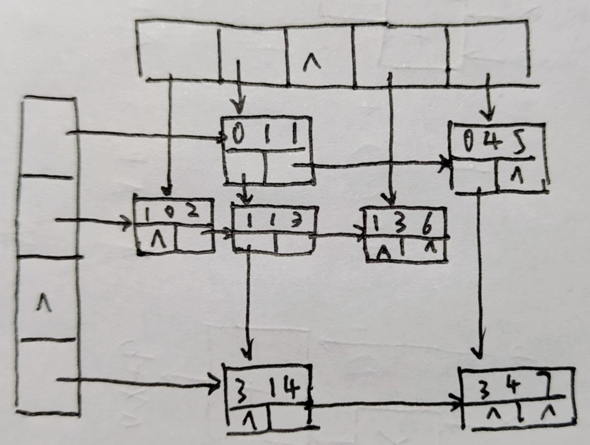

#### 5.1

```c++
A[0][0][0][0]
A[0][0][0][1]
A[0][0][0][2]
A[0][0][1][0]
A[0][0][1][1]
A[0][0][1][2]
A[0][1][0][0]
A[0][1][0][1]
A[0][1][0][2]
A[0][1][1][0]
A[0][1][1][1]
A[0][1][1][2]
A[0][2][0][0]
A[0][2][0][1]
A[0][2][0][2]
A[0][2][1][0]
A[0][2][1][1]
A[0][2][1][2]
A[1][0][0][0]
A[1][0][0][1]
A[1][0][0][2]
A[1][0][1][0]
A[1][0][1][1]
A[1][0][1][2]
A[1][1][0][0]
A[1][1][0][1]
A[1][1][0][2]
A[1][1][1][0]
A[1][1][1][1]
A[1][1][1][2]
A[1][2][0][0]
A[1][2][0][1]
A[1][2][0][2]
A[1][2][1][0]
A[1][2][1][1]
A[1][2][1][2]
```

---

#### 5.2

1. $6\times8\times6=288$
2. $1000+6\times(6\times8-1)=1282$
3. $1000+6\times(21-1)=1120$
4. $1000+6\times(27-1)=1156$

---

#### 5.3

$
k=\frac{(n+n-i+2)\times(i-1)}{2}+(j-i+1)-1=-\frac{i^2}{2}+(\frac{1}{2}+n)i+j-n-1
$

​ 所以

​$f_{1}(i)=-\frac{i^2}{2}+(\frac{1}{2}+n)i $
​$f_2(j)=j$
​$c=-n-1$

---

#### 5.4

$
k=-1+2\times(i-1)+2-(\lceil\frac{i}{2}\rceil-\lfloor\frac{i}{2}\rfloor)+j-i=i+j-\lceil\frac{i}{2}\rceil+\lfloor\frac{i}{2}\rfloor-1
$

---

#### 5.5

(1)

$
(0,1,1)\ \ (0,4,5)\ \ (1,0,2)\ \ (1,1,3)\ \ (1,3,6)\ \ (3,1,4)\ \ (3,4,7)
$

(2) 
